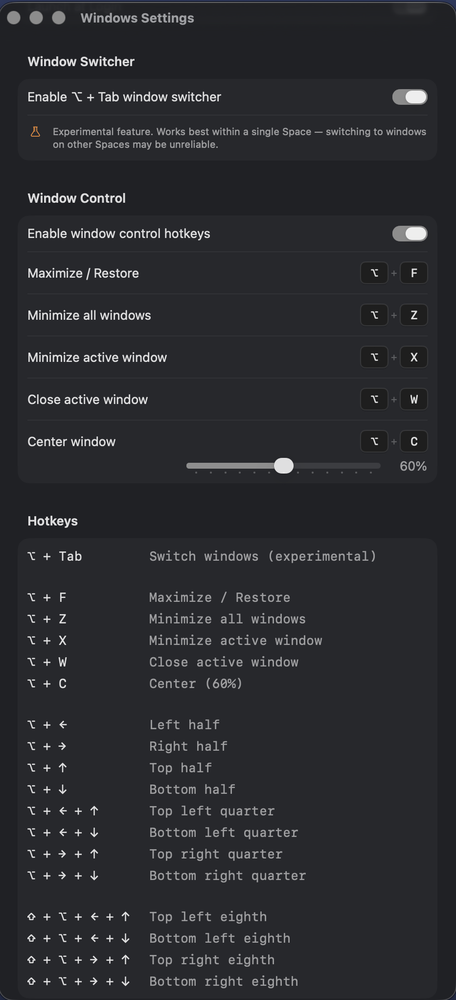
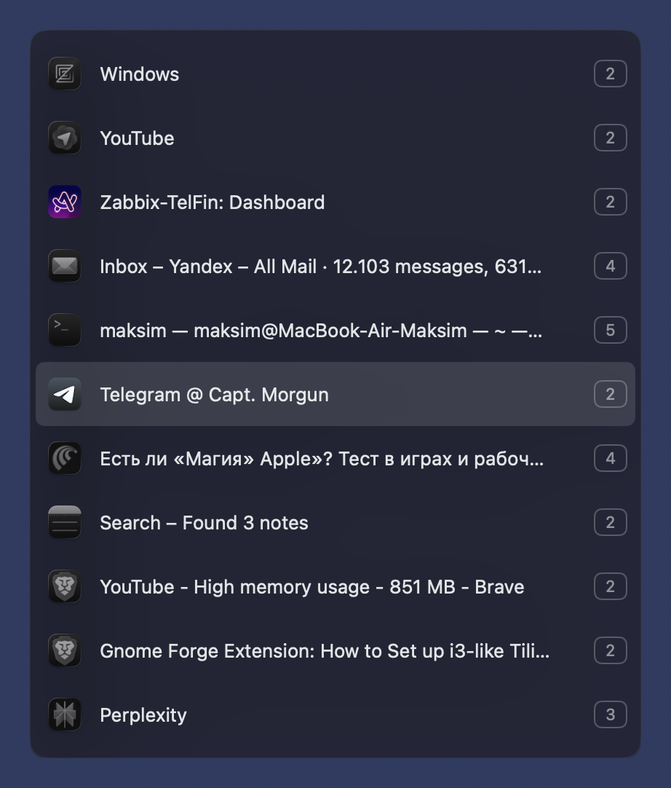

# Windows

A lightweight window manager for macOS. Not a tiling manager — it lets you snap any window to a precise position on screen using keyboard shortcuts, without forcing a tiling layout on all your windows.




## Features

- Snap windows to halves, quarters, and eighths of the screen
- Center any window at a configurable size with a single shortcut
- Configurable split ratios (left/right width, top/bottom height)
- **Window Control** — maximize/restore, minimize, close windows via configurable hotkeys
- **Window Switcher** — hold Mod+Tab to cycle through open windows across all Spaces
- **App Layouts** — pin apps to specific Desktops and restore your workspace layout in one click (experimental)
- All hotkeys fully configurable in Settings
- Menu bar app — lives quietly in the background
- Launch at Login option in Settings

## Shortcuts

Hold your chosen modifier key (Option, Command, or Control), then press arrow keys:

| Shortcut | Action |
|---|---|
| Mod + C | Center window (configurable size) |
| Mod + ← | Left half |
| Mod + → | Right half |
| Mod + ↑ | Top half |
| Mod + ↓ | Bottom half |
| Mod + ← + ↑ | Top left quarter |
| Mod + ← + ↓ | Bottom left quarter |
| Mod + → + ↑ | Top right quarter |
| Mod + → + ↓ | Bottom right quarter |
| ⇧ + Mod + ← + ↑ | Top left eighth |
| ⇧ + Mod + ← + ↓ | Bottom left eighth |
| ⇧ + Mod + → + ↑ | Top right eighth |
| ⇧ + Mod + → + ↓ | Bottom right eighth |

### Window Control

Configurable hotkeys for window management (defaults shown):

| Shortcut | Action |
|---|---|
| Mod + M | Maximize / Restore |
| Mod + D | Minimize all windows |
| Mod + H | Minimize active window |
| Mod + W | Close active window |
| Mod + C | Center window |

All keys can be changed in Settings. Window Control can be enabled or disabled independently.

### Window Switcher



| Shortcut | Action |
|---|---|
| Mod + Tab | Open switcher / next window |
| ↑ / ↓ | Navigate the list |
| Release Mod | Switch to selected window |
| Escape | Cancel |

Shows all open windows across all apps and all Spaces. If an app has multiple windows open, each appears as a separate entry. Each window shows the Desktop number it belongs to. Switching to a window on another Space moves you there automatically.

The Window Switcher can be enabled or disabled in Settings.

### App Layouts (experimental)

Assign apps to specific Desktops and snap positions, then restore your entire workspace in one click — from the menu bar or from Settings.

- Create any number of layouts, each mapped to a Desktop (Layout 1 → Desktop 1, etc.)
- Add apps to a layout and choose their snap position (left half, top right quarter, etc.)
- Optionally pin a file or folder to open with the app
- **Apply Layouts Now** in the menu bar applies all layouts at once
- **Apply Now** per layout in Settings applies just that Desktop

When applying, the app checks which windows are already in place, moves misplaced ones to the correct Desktop, and launches any that aren't running yet.

## Installation

Since the app is not notarized, macOS will block it on first launch. To open it:

1. Mount the DMG and drag **windows.app** to Applications
2. Try to open it — macOS will show *"can't be opened because it is from an unidentified developer"*
3. Go to **System Settings → Privacy & Security**
4. Scroll down and click **"Open Anyway"**
5. Click **Open** in the confirmation dialog

Alternatively, you can run this command in Terminal after copying the app to Applications:
```bash
xattr -cr /Applications/windows.app
```

## Requirements

- macOS 13+
- Accessibility permission
